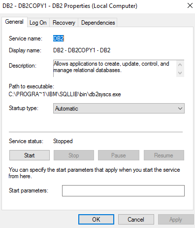
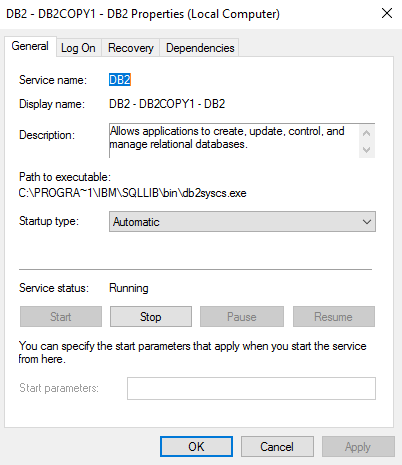

# Getting Sarted

[comment]: <> (Delete next Line as it was generated as a bulletpoint by VSCODE Extension)


- [Getting Sarted](#getting-sarted)
    - [Objectives](#objectives)
- [Part A](#part-a)
    - [2. Examine the operating system environment variable settings. What is the DB2 instance currently set to? What is the installation path of DB2?](#2-examine-the-operating-system-environment-variable-settings-what-is-the-db2-instance-currently-set-to-what-is-the-installation-path-of-db2)
    - [3. What is the command to list out all the defined DB2 profile registry variables for the DB2 server?sd](#3-what-is-the-command-to-list-out-all-the-defined-db2-profile-registry-variables-for-the-db2-serversd)
    - [4. Is DB2COMM a valid DB2 profile registry variable? What command can be used to validate it?](#4-is-db2comm-a-valid-db2-profile-registry-variable-what-command-can-be-used-to-validate-it)
    - [5. `DB2COMM` specifies the communication managers to be started when the instance (also known as database manager) is started. This allows remote connection to the databases defined in the instance via protocol set with this DB2 profile registry variable. Set the DB2 profile registry variable `DB2COMM=TCPIP` on instance level. If this is not set, no DB2 communications managers are started at the server. (Changes in DB2 profile registry variables will take in effect after the instance is stopped and restarted. We will recycle the instance later.)](#5-db2comm-specifies-the-communication-managers-to-be-started-when-the-instance-also-known-as-database-manager-is-started-this-allows-remote-connection-to-the-databases-defined-in-the-instance-via-protocol-set-with-this-db2-profile-registry-variable-set-the-db2-profile-registry-variable-db2commtcpip-on-instance-level-if-this-is-not-set-no-db2-communications-managers-are-started-at-the-server-changes-in-db2-profile-registry-variables-will-take-in-effect-after-the-instance-is-stopped-and-restarted-we-will-recycle-the-instance-later)
    - [6. Besides the DB2 instance, what other instances are defined in the DB2 server?](#6-besides-the-db2-instance-what-other-instances-are-defined-in-the-db2-server)
    - [7. Obtain a list of databases within the DB2 instance.](#7-obtain-a-list-of-databases-within-the-db2-instance)
    - [8. Create the SAMPLE database. An executable called db2sampl.exe comes with the DB2 installation. It will create a SAMPLE database on the C drive (by default), create tables, and populate them with sample data. Issue `db2sampl` from the command window.](#8-create-the-sample-database-an-executable-called-db2samplexe-comes-with-the-db2-installation-it-will-create-a-sample-database-on-the-c-drive-by-default-create-tables-and-populate-them-with-sample-data-issue-db2sampl-from-the-command-window)
    - [9. Obtain a list of databases within the DB2 instance again to verify SAMPLE is created successfully.](#9-obtain-a-list-of-databases-within-the-db2-instance-again-to-verify-sample-is-created-successfully)
    - [10. Connect to SAMPLE. List out all tables created in SAMPLE. How many tables are created under userid/schema administrator?](#10-connect-to-sample-list-out-all-tables-created-in-sample-how-many-tables-are-created-under-useridschema-administrator)
    - [11. Open another DB2 Command Window. Find out how many connections are made to the DB2 instance. What is the user id, application name, and application handle for each connection to the SAMPLE database?](#11-open-another-db2-command-window-find-out-how-many-connections-are-made-to-the-db2-instance-what-is-the-user-id-application-name-and-application-handle-for-each-connection-to-the-sample-database)
    - [12. Stop the DB2 instance from the second command window. What error do you receive? Why?](#12-stop-the-db2-instance-from-the-second-command-window-what-error-do-you-receive-why)
    - [13. What are the five alternatives to solve the problem? Go back to the first command window, disconnect from SAMPLE. List the connections. How many connections are there now?](#13-what-are-the-five-alternatives-to-solve-the-problem-go-back-to-the-first-command-window-disconnect-from-sample-list-the-connections-how-many-connections-are-there-now)
    - [14. Close the first command window. At the second command window, stop the instance. Is the instance stopped? `WinKey+S -> Control Panel -> Administrative Tools -> Services`. Find the DB2 – DB2 copy - DB2 service in the list and check if it is really stopped.](#14-close-the-first-command-window-at-the-second-command-window-stop-the-instance-is-the-instance-stopped-winkeys---control-panel---administrative-tools---services-find-the-db2--db2-copy---db2-service-in-the-list-and-check-if-it-is-really-stopped)
    - [15. Start the DB2 instance.](#15-start-the-db2-instance)
    - [16. What command can be used to verify that for your running command window command line processor option AUTOCOMMIT is on?](#16-what-command-can-be-used-to-verify-that-for-your-running-command-window-command-line-processor-option-autocommit-is-on)
- [Questions](#questions)

### Objectives

- Use the DB2 Command Window to perform most of the steps listed below
- Examine the environment that DB2 runs in
- Examine the DB2 profile registry
- Create the SAMPLE database
- Use DB2 manuals for reference

---

# Part A

### 2. Examine the operating system environment variable settings. What is the DB2 instance currently set to? What is the installation path of DB2?
via `set | findstr DB2*`:
- `DB2INSTANCE=DB2`
- `DB2PATH=C:\Program Files\IBM\SQLLIB`

alternatively one could do:
```bash
  >> echo %DB2INSTANCE%
```
### 3. What is the command to list out all the defined DB2 profile registry variables for the DB2 server?sd
`db2set -all`


### 4. Is DB2COMM a valid DB2 profile registry variable? What command can be used to validate it?
- display all valid variables via `db2set -lr`:
  ```bash
  >> set -lr | findstr DB2COMM
  DB2COMM
  ```
- `db2set <VARIABLE>` prints information about a valid variable and an error on invalid ones:
  ```bash
    >> db2set DB2COMM

    DBI1303W  Variable not set.

    Explanation:

    The variable was not set in the profile registry.

    User response:

    No further action is required.
  ```


### 5. `DB2COMM` specifies the communication managers to be started when the instance (also known as database manager) is started. This allows remote connection to the databases defined in the instance via protocol set with this DB2 profile registry variable. Set the DB2 profile registry variable `DB2COMM=TCPIP` on instance level. If this is not set, no DB2 communications managers are started at the server. (Changes in DB2 profile registry variables will take in effect after the instance is stopped and restarted. We will recycle the instance later.)
```bash
>> db2set DB2COMM=TCPIP
```
### 6. Besides the DB2 instance, what other instances are defined in the DB2 server?
```bash
>> db2ilist
DEVELOP
DB2
```
additional instances can be created via `db2icrt <name>`.

### 7. Obtain a list of databases within the DB2 instance.
```bash
>> db2 list db directory
SQL1057W  The system database directory is empty.  SQLSTATE=01606
```

### 8. Create the SAMPLE database. An executable called db2sampl.exe comes with the DB2 installation. It will create a SAMPLE database on the C drive (by default), create tables, and populate them with sample data. Issue `db2sampl` from the command window.
```bash
>> db2sampl
Creating database "SAMPLE"...
Connecting to database "SAMPLE"...
Creating tables and data in schema"ADMINISTRATOR"...
Creating tables with XML columnsand XML data in schema"ADMINISTRATOR"...
'db2sampl' processing complete.
```
### 9. Obtain a list of databases within the DB2 instance again to verify SAMPLE is created successfully.
```bash
>> db2 list db directory

 System Database Directory

 Number of entries in the directory = 1

 Database 1 entry:

 Database alias                       = SAMPLE
 Database name                        = SAMPLE
 Local database directory             = C:
 Database release level               = 14.00
 Comment                              =
 Directory entry type                 = Indirect
 Catalog database partition number    = 0
 Alternate server hostname            =
 Alternate server port number         =
```

### 10. Connect to SAMPLE. List out all tables created in SAMPLE. How many tables are created under userid/schema administrator?
connect:
```bash
>> db2 connect to SAMPLE

 Database Connection Information

 Database server        = DB2/NT64 11.1.1.1
 SQL authorization ID   = ADMINIST...
 Local database alias   = SAMPLE
```
display tables:
```bash
>> db2 list tables for schema ADMINISTRATOR

Table/View                      Schema          Type  Creation time
------------------------------- --------------- ----- --------------------------
ACT                             ADMINISTRATOR   T     2022-10-25-23.51.22.181003
ADEFUSR                         ADMINISTRATOR   S     2022-10-25-23.51.23.672001
...
VSTAFAC1                        ADMINISTRATOR   V     2022-10-25-23.51.22.607002
VSTAFAC2                        ADMINISTRATOR   V     2022-10-25-23.51.22.614002

47 record(s) selected.
```

### 11. Open another DB2 Command Window. Find out how many connections are made to the DB2 instance. What is the user id, application name, and application handle for each connection to the SAMPLE database?

```bash
>> db2 list applications for database sample

Auth Id  Application    Appl.      Application Id                                                 DB       # of
         Name           Handle                                                                    Name    Agents
-------- -------------- ---------- -------------------------------------------------------------- -------- -----
ADMINIS> db2bp.exe      35         *LOCAL.DB2.221025215921                                        SAMPLE   1
```

### 12. Stop the DB2 instance from the second command window. What error do you receive? Why?
```bash
>> db2stop
SQL1025N  The database manager was not stopped because databases are still active.
```

### 13. What are the five alternatives to solve the problem? Go back to the first command window, disconnect from SAMPLE. List the connections. How many connections are there now?

1-3. Close all connections by using one of: `db2 connect reset`, `db2 terminate` or `db2 disconnect` per client and then `db2stop` 
4. `force application all` forcefully disconnects all connected clients followed by `db2stop`
5. `db2stop force`

```bash
>> db2 force application all
DB20000I  The FORCE APPLICATION command completed successfully.
DB21024I  This command is asynchronous and may not be effective immediately.

>> db2stop
SQL1064N  DB2STOP processing was successful.

>> db2 list applications show details
SQL1032N  No start database manager command was issued.  SQLSTATE=57019
```

### 14. Close the first command window. At the second command window, stop the instance. Is the instance stopped? `WinKey+S -> Control Panel -> Administrative Tools -> Services`. Find the DB2 – DB2 copy - DB2 service in the list and check if it is really stopped.


### 15. Start the DB2 instance.
```bash
>> db2start
SQL1063N  DB2START processing was successful.
```


### 16. What command can be used to verify that for your running command window command line processor option AUTOCOMMIT is on?

```bash
>> db2 list command options | findstr Auto-Commit
   -c    Auto-Commit                               ON
```

this can be altered via `db2 update command options using c <ON/OFF>` or `db2 <-c/+c>`

---

# Questions

did I list the connections in [13.](#13-what-are-the-five-alternatives-to-solve-the-problem-go-back-to-the-first-command-window-disconnect-from-sample-list-the-connections-how-many-connections-are-there-now) properly?


