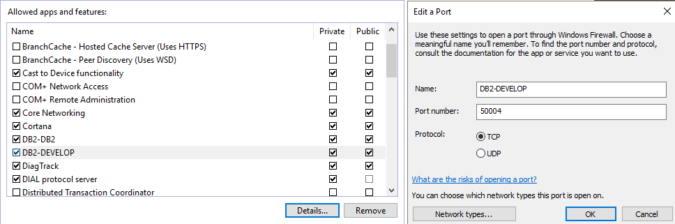

# Getting Connected

- [Getting Connected](#getting-connected)
    - [Objectives](#objectives)
- [Exercises](#exercises)
    - [1. Open a DB2 Command Window. How many instances are available? What is the current instance? How many databases are cataloged in the DB2 instance? Obtain the following information for the SAMPLE database: Database name, Database alias name, Directory entry type, Database drive or Node name](#1-open-a-db2-command-window-how-many-instances-are-available-what-is-the-current-instance-how-many-databases-are-cataloged-in-the-db2-instance-obtain-the-following-information-for-the-sample-database-database-name-database-alias-name-directory-entry-type-database-drive-or-node-name)
    - [2. Connect to the database SAMPLE and select from the EMPLOYEE table. Insert another employee into the EMPLOYEE table with your firstname and lastname.](#2-connect-to-the-database-sample-and-select-from-the-employee-table-insert-another-employee-into-the-employee-table-with-your-firstname-and-lastname)
    - [3. Customize your CLP prompt by using the DB2_CLPPROMPT registry variable. This will show you instance attachment, database connection and user authorization. So, you will not get lost in the following exercises.](#3-customize-your-clp-prompt-by-using-the-db2_clpprompt-registry-variable-this-will-show-you-instance-attachment-database-connection-and-user-authorization-so-you-will-not-get-lost-in-the-following-exercises)
    - [4. You are now enabling one of your instances for being accessed by a remote client:](#4-you-are-now-enabling-one-of-your-instances-for-being-accessed-by-a-remote-client)
    - [5. Let your classmate catalog your instance and your database by telling him your current IP-address, which comes from the title of your RDP-window, e.g. 18.156.82.154 for a title like “ec2-18-156-82-154.eu-central- 1.compute.amazonaws.com”. See next step how to catalog. Follow the manipulation of your data done by your classmate.](#5-let-your-classmate-catalog-your-instance-and-your-database-by-telling-him-your-current-ip-address-which-comes-from-the-title-of-your-rdp-window-eg-1815682154-for-a-title-like-ec2-18-156-82-154eu-central--1computeamazonawscom-see-next-step-how-to-catalog-follow-the-manipulation-of-your-data-done-by-your-classmate)
    - [6. Make your computer a client to access a remote server run by one of your classmates:](#6-make-your-computer-a-client-to-access-a-remote-server-run-by-one-of-your-classmates)
    - [7. Examine the node and database directories, for each instance separately.](#7-examine-the-node-and-database-directories-for-each-instance-separately)
    - [8. Connect to the remote RMTSAMP database as user Administrator. Select all rows from the EMPLOYEE table. Show the proof that you really see the remote EMPLOYEE table of your classmate instead of yours. Insert another employee into the EMPLOYEE table with your firstname and lastname.](#8-connect-to-the-remote-rmtsamp-database-as-user-administrator-select-all-rows-from-the-employee-table-show-the-proof-that-you-really-see-the-remote-employee-table-of-your-classmate-instead-of-yours-insert-another-employee-into-the-employee-table-with-your-firstname-and-lastname)

### Objectives
Examine the DB2 node and database directories
- Catalog nodes and databases using the DB2 Command Window
- Connect to a remote database
- Attach to a remote node

---

# Exercises

### 1. Open a DB2 Command Window. How many instances are available? What is the current instance? How many databases are cataloged in the DB2 instance? Obtain the following information for the SAMPLE database: Database name, Database alias name, Directory entry type, Database drive or Node name

```bash
>> db2ilist
DEVELOP
DB2

>> set | findstr DB2*
DB2INSTANCE=DB2
DB2PATH=C:\Program

>> db2 list db directory

System Database Directory
Number of entries in thedirectory = 1
Database 1 entry:
Databasealias                       =SAMPLE
Databasename                        =SAMPLE
Local databasedirectory             = C:
Database releaselevel               = 14.00
Comment                             =
Directory entrytype                 = Indirect
Catalog database partitionnumber    = 0
Alternate serverhostname            =
Alternate server portnumber         =
```

### 2. Connect to the database SAMPLE and select from the EMPLOYEE table. Insert another employee into the EMPLOYEE table with your firstname and lastname.
```bash
>> db2 connect to SAMPLE

Database Connection Information

 Database server        = DB2/NT64 11.1.1.1
 SQL authorization ID   = ADMINIST...
 Local database alias   = SAMPLE


>> db2
...
```
```SQL
db2 => SELECT * FROM EMPLOYEE

EMPNO  FIRSTNME     MIDINIT LASTNAME        WORKDEPT PHONENO HIREDATE   JOB      EDLEVEL SEX BIRTHDATE  SALARY      BONUS       COMM
------ ------------ ------- --------------- -------- ------- ---------- -------- ------- --- ---------- ----------- ----------- -----------
000010 CHRISTINE    I       HAAS            A00      3978    01/01/1995 PRES          18 F   08/24/1963   152750.00     1000.00     4220.00
000020 MICHAEL      L       THOMPSON        B01      3476    10/10/2003 MANAGER       18 M   02/02/1978    94250.00      800.00     3300.00


db2 => INSERT INTO employee (empno, firstnme, lastname, edlevel) VALUES (42069, 'Nils', 'Lubenius', 99)
DB20000I  The SQL command completed successfully.
```

### 3. Customize your CLP prompt by using the DB2_CLPPROMPT registry variable. This will show you instance attachment, database connection and user authorization. So, you will not get lost in the following exercises.

```bash
>> db2set DB2_CLPPROMPT=(%ia@%i," "%da@%d)

>> db2
(@DB2, @)connect to sample

Database Connection Information

Database server        = DB2/NT64 11.1.1.1
SQL authorization ID   = ADMINIST...
Local database alias   = SAMPLE

(@DB2, ADMINIST@SAMPLE)
```

### 4. You are now enabling one of your instances for being accessed by a remote client:

- Set your current instance to DEVELOP
  `set DB2INSTANCE=DEVELOP`
- Set TCP as communication protocol
  `db2set DB2COMM=tcpip` 
- Set service db2c_develop to listen on port 50004 
  - update dbm cfg using SVCENAME db2c_develop;
    ```bash
    >> db2 update dbm cfg using SVCENAME db2c_develop
    DB20000I  The UPDATE DATABASE MANAGER CONFIGURATION command completed successfully.
    ```
  - open C:\Windows\system32\drivers\etc\services and add db2c_DEVELOP 50004/TCP (already done by lecturer)
    `db2c_DEVELOP	 50004/tcp                           #DB2 instance DEVELOP`
- Start instance DEVELOP
  ```bash
  >> db2start
  SQL1063N  DB2START processing was successful.
  ```
- Create sample database
  ```bash
  >> db2sampl

  Creating database "SAMPLE"...
  Connecting to database "SAMPLE"...
  Creating tables and data in schema "ADMINISTRATOR"...
  Creating tables with XML columns and XML data in schema "ADMINISTRATOR"...

  'db2sampl' processing complete.
  ```
- Configure your windows firewall to allow inbound communication via TCP port 50004 (already done by lecturer)
  

- NOTES:
  The port has to be set via `db2 update dbm cfg using SVCENAME 50004` (not sure why the db2c_develop cmd was needed).
  To enforce the catalog changes restart the manager: 
  1. `db2 terminate`
  2. `db2stop`
  3. `db2start`

  To verify the tcp connection:
  ```bash
  >> netstat -tan | findstr 50004
  TCP    0.0.0.0:50004          0.0.0.0:0              LISTENING       InHost
  TCP    [::]:50004             [::]:0                 LISTENING       InHost
  ```

### 5. Let your classmate catalog your instance and your database by telling him your current IP-address, which comes from the title of your RDP-window, e.g. 18.156.82.154 for a title like “ec2-18-156-82-154.eu-central- 1.compute.amazonaws.com”. See next step how to catalog. Follow the manipulation of your data done by your classmate.

### 6. Make your computer a client to access a remote server run by one of your classmates:

- Set your current instance to DB2
  `set DB2INSTANCE=DB2`
- Catalog a TCPIP node. Use TCPIP as protocol, ask one of your classmates
for his IP-address as hostname, use 50004 as services name (which is
actually the port number of the instance), use DEVELOP as instance
name, and omit other optional clauses. Name this node entry RMTNODE.
  ```bash
  (@DB2, @)catalog tcpip node RMTNODE remote >REMOTE_IP> server 50004 remote_instance DEVELOP
  DB20000I  The CATALOG TCPIP NODE command completed successfully.
  DB21056W  Directory changes may not be effective until the directory cache is
  refreshed
  ```

- Catalog the remote database SAMPLE. USE RMTSAMP as database
alias, RMTNODE as node name, SERVER as authentication type, and
omit other optional clauses. Why using a database alias?
  ```bash
  (@DB2, @)catalog database SAMPLE as RMTSAMP at node RMTNODE authentication SERVER
  DB20000I  The CATALOG DATABASE command completed successfully.
  DB21056W  Directory changes may not be effective until the directory cache is
  refreshed.
  ```
  The alias is used to differentiate between the local and remote databases named DEVELOP.

### 7. Examine the node and database directories, for each instance separately.

- DB2:
  ```bash
  >> db2 list db directory

  System Database Directory
  Number of entries in the directory = 2

  Database 1 entry:

  Database alias                       = RMTSAMP
  Database name                        = SAMPLE
  Node name                            = RMTNODE
  Database release level               = 14.00
  Comment                              =
  Directory entry type                 = Remote
  Authentication                       = SERVER
  Catalog database partition number    = -1
  Alternate server hostname            =
  Alternate server port number         =

  Database 2 entry:

  Database alias                       = SAMPLE
  Database name                        = SAMPLE
  Local database directory             = C:
  Database release level               = 14.00
  Comment                              =
  Directory entry type                 = Indirect
  Catalog database partition number    = 0
  Alternate server hostname            =
  Alternate server port number         =

  >> db2 list node directory

  Node Directory

  Number of entries in the directory = 1

  Node 1 entry:

  Node name                      = RMTNODE
  Comment                        =
  Directory entry type           = LOCAL
  Protocol                       = TCPIP
  Hostname                       = <REMOTE_IP>
  Service name                   = 50004
  ```

- DEVELOP:
  ```bash
  >> db2 list db directory

  System Database Directory

  Number of entries in the directory = 1

  Database 1 entry:

  Database alias                       = SAMPLE
  Database name                        = SAMPLE
  Local database directory             = C:
  Database release level               = 14.00
  Comment                              =
  Directory entry type                 = Indirect
  Catalog database partition number    = 0
  Alternate server hostname            =
  Alternate server port number         =

  >> db2 list node director
  SQL1027N  The node directory cannot be found.
  ```

### 8. Connect to the remote RMTSAMP database as user Administrator. Select all rows from the EMPLOYEE table. Show the proof that you really see the remote EMPLOYEE table of your classmate instead of yours. Insert another employee into the EMPLOYEE table with your firstname and lastname.
```bash
>> db2 connect to RMTSAMP
SQL30081N  A communication error has been detected. Communication protocol
being used: "TCP/IP".  Communication API being used: "SOCKETS".  Location
where the error was detected: "3.69.146.24".  Communication function detecting
the error: "connect".  Protocol specific error code(s): "10060", "*", "*".
SQLSTATE=08001

>> db2 attach to RMTNODE
SQL30081N  A communication error has been detected. Communication protocol
being used: "TCP/IP".  Communication API being used: "SOCKETS".  Location
where the error was detected: "3.69.146.24".  Communication function detecting
the error: "connect".  Protocol specific error code(s): "10060", "*", "*".
SQLSTATE=08001
```